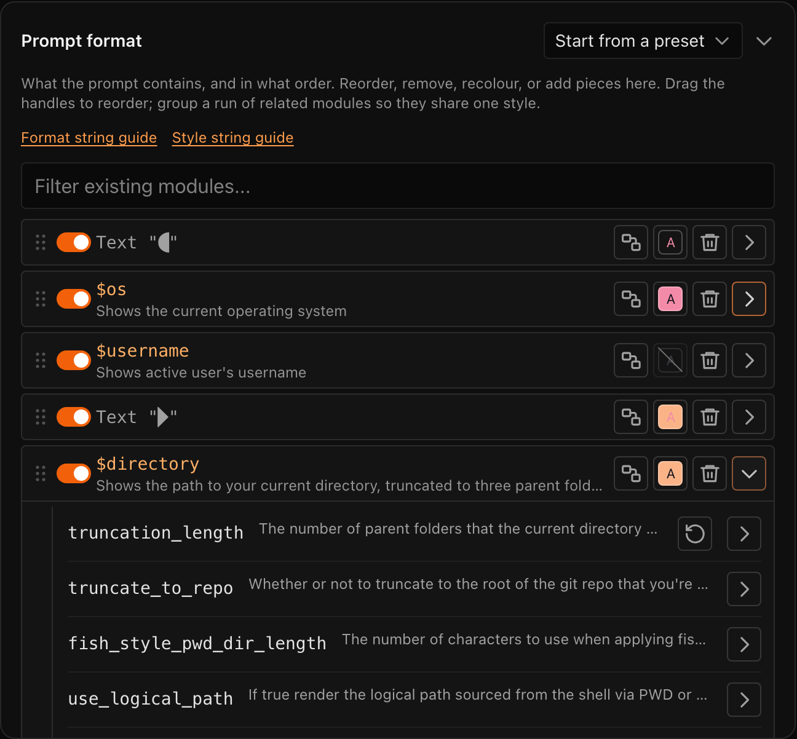
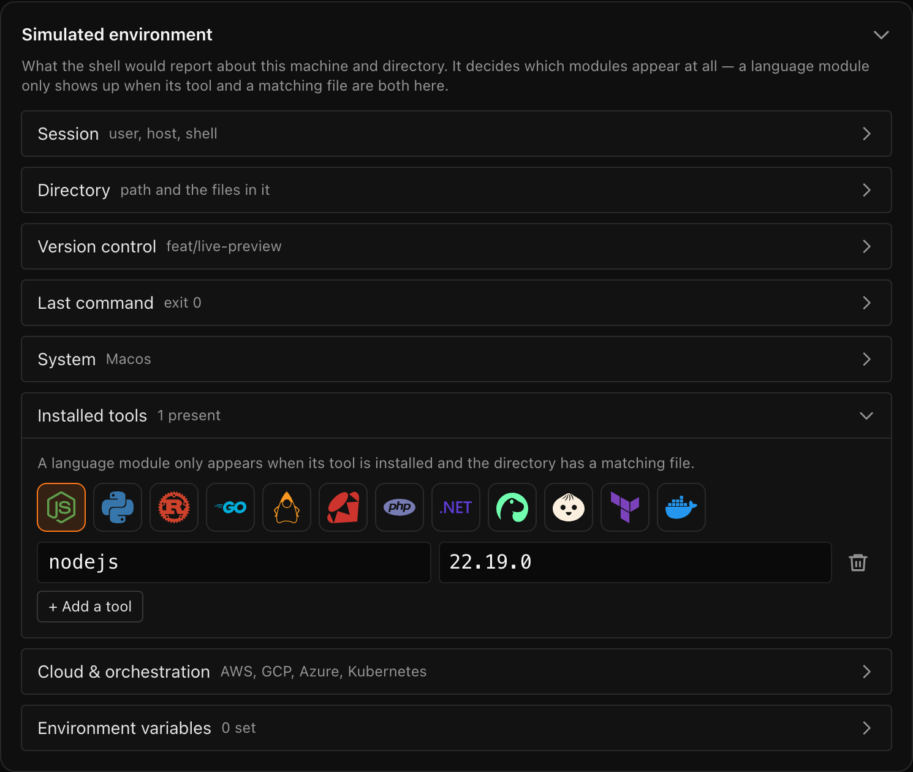

<div align="center">

# Starship Prompt Builder

**A visual editor for `starship.toml`.**

Edit any of [Starship](https://starship.rs)'s 102 modules, their styles and
their format strings against a live preview of a simulated shell — then export
the config that reproduces it. Everything runs in your browser: no account, no
upload, no backend.

### [→ Open the builder](https://starship.ndl.au/)


</div>

## Why

Starship is configured by one file with around a hundred modules in it, each
with its own format string and style string. Tuning that file normally means
editing it, reloading your shell, squinting at the result, and going back —
and the modules that matter most are the ones you cannot see until you are in
a git repo, on a failed command, or inside a Rust project.

This closes that loop. The prompt re-renders as you type, against an
environment you control, and what you export is the exact file that produces
it.

## What it does

- **Renders your prompt properly.** The formatter is a port of starship's own —
  its `pest` grammar, its style parser, its conditional and text-group
  semantics, its ANSI difference algorithm — checked against the real binary by
  a [parity suite](tests/parity) that runs `starship prompt` and compares raw
  bytes.
- **Every module, every option.** All 102 modules in starship's prompt order,
  with defaults copied from its Rust source and verified code point by code
  point, driven by the vendored config schema.
- **A simulated environment.** Which modules appear depends on the shell, the
  directory, the git state, the installed tools, the last command's exit code.
  All of it is editable, and a module that is on but invisible says why.
- **Format editing, visually.** Reorder by dragging, group related modules so
  they share a style, recolour with palette-aware pickers, and edit any format
  string as structure rather than text.
- **The real thing, exported.** Paste an existing `starship.toml` to load it;
  export a minimal config that omits defaults. Options this builder does not
  recognise survive the round trip untouched.
- **Presets and palettes.** All 12 official presets, and a palette editor for
  naming your own colours.
- **Shareable links.** The config compresses into the URL fragment, so a link
  reproduces a prompt exactly. The config itself is never uploaded.

<div align="center">

| Module settings, in place | The simulated environment |
| --- | --- |
|  |  |

</div>

It follows your system's colour scheme, works on a phone — including dragging
to reorder — and passes WCAG 2.1 AA in both themes.

<div align="center">

| Dark | Light |
| --- | --- |
|  |  |


</div>

## Development

With [nix](https://nixos.org) + [direnv](https://direnv.net), which pin node
and pnpm:

```sh
direnv allow
pnpm install
pnpm dev
```

Or bring your own Node ≥ 20 with pnpm. The site is a fully static Next.js
export (`pnpm build` → `out/`), served under the `/starship-prompt-builder`
base path.

```sh
pnpm typecheck     # tsc --noEmit
pnpm test          # unit tests
pnpm test:e2e      # browser tests, against the built export
pnpm test:parity   # engine vs the real starship binary (needs it installed)
```

Stack: Next.js 16 · React 19 · Tailwind CSS v4 · TypeScript. The pure
rendering engine, config translators, zustand state, and React coordinators have
explicit boundaries documented in [PLAN.md](PLAN.md) and
[CONTRIBUTING.md](CONTRIBUTING.md); [AGENTS.md](AGENTS.md) has the working
conventions.

## Contributing

Yes please — particularly module fidelity. Each starship module is a single
file with a small contract, and [CONTRIBUTING.md](CONTRIBUTING.md) walks
through adding or correcting one, including how to prove it against the real
binary.

## Analytics

Traffic to the deployed site is counted at Cloudflare's edge, from the
requests themselves; Cloudflare Web Analytics adds per-page detail by injecting
its own beacon into proxied responses. Either way the counting is the edge's
work — so **this repository contains no analytics code at all**, and a fork or
a local build reports nowhere by construction rather than by configuration. It
is cookieless, and nothing about your config is sent: it never leaves the
browser.

## Licence

[MIT](LICENSE). Starship Prompt Builder is an unaffiliated community tool.
Starship itself is ISC-licensed — vendored artefacts (config schema, presets)
retain attribution in [data/README.md](data/README.md).

Third-party material redistributed by this site — the bundled Nerd Fonts and
the vendored Starship data — is catalogued with its licences in
[THIRD_PARTY.md](THIRD_PARTY.md). Every bundled font is redistributable and
web-embeddable (SIL OFL 1.1, MIT, or Bitstream Vera); per-font provenance and
the fonts deliberately excluded are documented in
[public/fonts/README.md](public/fonts/README.md).
